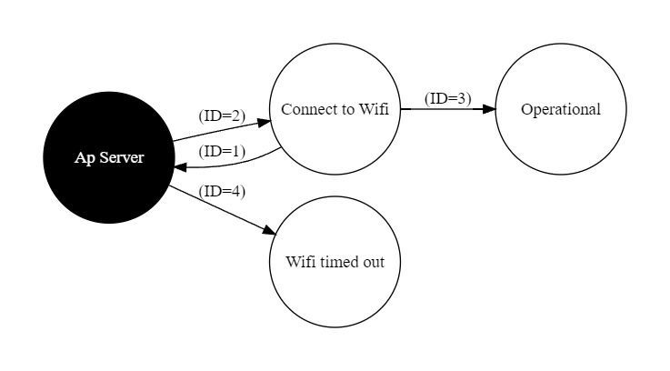

# FSM con AP Server prueba de concepto

## Dependencias:

- ESP Async WebServer
- lennarthennigs/SimpleFSM

## Descripcion

Implementacion de un servidor Ap con portal cautivo y un maquina de estados 
finitos para controlar el acceso a la red.

- El servidor AP se inicia y se configura con un portal cautivo.
- El usuario se conecta a la red y se le redirige a la pagina para que ingrese las credenciales de la red wifi.
- Se redirecciona a la pagina de coneccion y se cambia el estado a conectando al wifi.
- En caso de no podes conectar al wifi despues de 12 intentos se vuelve al estado anterior.
- En caso de conectarse al wifi se cambia al estado de logueo y espera.

